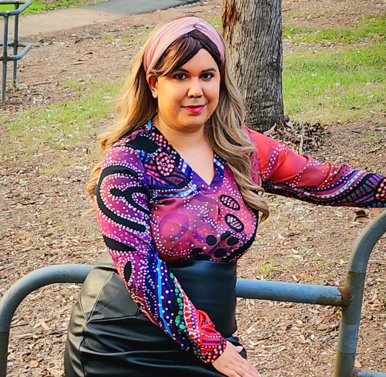
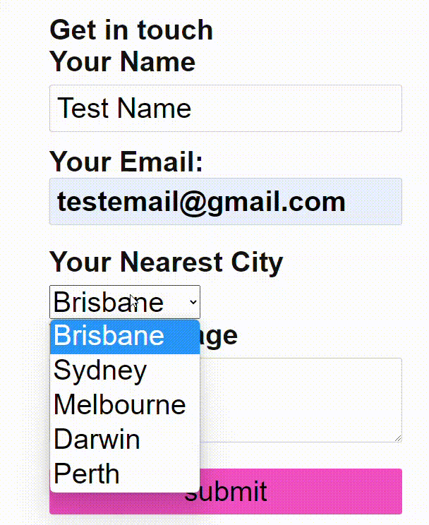
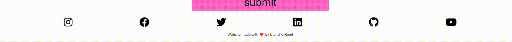
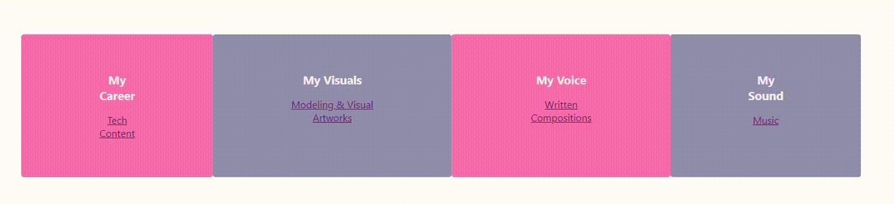
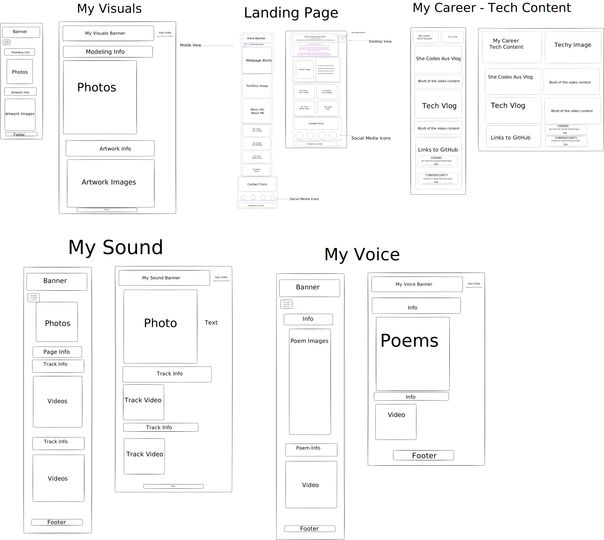

# Blanche Reed - Portfolio Task

My portfolio site: Eclectic_Portfolio_Blanche_Reed
Link: https://blanchereed.github.io/Eclectic_Portfolio_Blanche_Reed/

## Project Requirements

### Content

- [x] At least one profile picture
      This profile picture is of me modeling at Bullocky Rest park. I chose this image to represent me on the webpage because I think the image represents one of my interests outside of work which is Indigenous fashion. I have placed the profile picture above the 'About Me' information to create a good flow.

- [x] Biography (at least 100 words)
      I aim to uplift my audience with practical advice and inspire the artist within us all! I try to evolve both my technical skills and creative endeavours in these featured projects to lead the way for my people in all communities. I identify as a First Nations woman with pronouns She/Her. I am a descendant of the Kalkadoon, Pitta Pitta, Mitakoodi, Gooreng Gooreng, Yidinji people. I am also neurodiverse/ a disability community member. I enjoy the following hobbies:
      Dancing/ Gym; Writing the manuscript for my novel; Learning Indigenous languages; Boxing; Writing songs and poems; Creating content for my YouTube channel; Posing in photos for my amateur modelling portfolio; Creating digital art & Sewing.

- [x] Functional Contact Form

This contact form is linked to 'Form Spree' so I can access the messages that are submitted.

- [x] "Projects" section
      Homepage: This webpage is to introduce myself and link the user to other webpages. I have also created a contact form and social media links.

My Career: This webpage is dedicated to my tech career journey. I have a written story and a vlog that I recorded.

My Visuals: This is a page that hosts five of my amateur modeling photos and some of my digital artworks.

My Voice: This webpage is a compilation of my poems and a video of a poem I read to the sound of the didgeridoo.

My Sound: This is a collection of my music tracks that are on YouTube.

- [x] Links to external sites, e.g. GitHub and LinkedIn.
      I have provided a screenshot in the format of a gif to display my social media links. I the bottom left corner you will see that the links are connected to my social media profiles on varipus sites.

### Technical

- [x] At least 2 web pages.
      I have created five webpages for my portfolio. I enjoyed coding these pages and each page serves the important purpose of showcasing an element of my personality. I think the hardest page to create was the Homepage. Other challenges I faced were with aligning images. The best part of this webpage portfolio project is that is will grow as I learn more.

- [x] Version controlled with Git
      I have been consistently pushing my code to my git repository named blancheReed. Link: https://github.com/blancheReed. I found a challenge in the initial push request as I was attempting to push videos from my local folder. I learnt how to remove items that have been a part of a previous push request. I also now embed my video content from YouTube as a best practice.

- [x] Deployed on GitHub pages.
      I have deployed my webpages onto GitHub pages. The link is provided at the top of this md file.

- [x] Implements responsive design principles.
      I have used the CSS media attribute to make my webpages responsive. I preferred the mobile design process the most.

- [x] Uses semantic HTML.

I used appropriate HTML tags: Instead of using generic div elements for everything, select the specific HTML tags that accurately describe the content they contain. For example:

Use header for the header section of your page.
Use nav for the navigation menu.
Use article for self-contained articles or blog posts.
Use section to group related content.
Use footer for the footer section of your page.

### Bonus (optional)

- [x] Different styles for active, hover and focus states.
      On the Homepage I used hover on the content panels. The filter was set to contrast at 150%.

- [x] Include JavaScript to add some dynamic elements to your site. (Extratricky!)
      I used the following JavaScript code to action behaviour in my navigation bar:

const hamburgerButton = document.querySelector(".hamburger-button");
const mobileNav = document.querySelector(".mobile-nav");

hamburgerButton.addEventListener("click", () => {
mobileNav.classList.toggle("display-none");
});

- [x] Hover of Content Panel

## The goals of your project.

The goals of my portfolio porject is to practice my HTML/CSS skillset that I have acquired during the three week module in the She Codes Australia Plus program. I aim to produce a deliverable that showcases website design principles and good coding best practices.

## A description of your target audience.

The target audience is to anyone interested the content I produce. The target audience may be interested in music, written works, visual art, photography or fashion and the tech industry.

## Some examples of page designs that you intend to draw inspiration from.

I enjoy the designs of social media platforms such as Facebook and Instagram. I like to colours of Instagram and I enjoy the design layout of facebook.

## Wireframes made with Excalidraw.

## Any design assets.

All social media icons are from the following website: https://fontawesome.com/

## Screenshots of Webpages

I have uploaded the screenshot videos to YouTube. Please follow the links provided to view the full screenshot provided of each webpage I have created.

- [x] Homepage

https://www.youtube.com/embed/5NrSBmh4mmM

https://www.youtube.com/embed/gOlpRahA_1Y

- [x] My Career

https://www.youtube.com/embed/rryz336qstI

https://www.youtube.com/embed/ghhTvbJvn7M

- [x] My Visuals

https://www.youtube.com/embed/fwSIk0K7AfE

https://www.youtube.com/embed/tM2pklsYC3U

- [x] My Voice

https://www.youtube.com/embed/UESidswrW6o

https://www.youtube.com/embed/YkbZ-0XwDqA

- [x] My Sound

https://www.youtube.com/embed/trlI2DHj2lM

https://www.youtube.com/embed/Ws0fqFPyRCg
