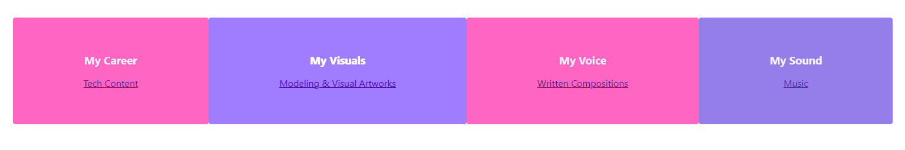

# {{ your_name_here }} - Portfolio Task

My portfolio site: Eclectic_Portfolio_Blanche_Reed Link: https://blanchereed.github.io/Eclectic_Portfolio_Blanche_Reed/

## Project Requirements

### Content

{{ Add a short paragraph describing the features below. }}

- [ ] At least one profile picture

- [ ] Biography (at least 100 words)

- [ ] Functional Contact Form

- [ ] "Projects" section

- [ ] Links to external sites, e.g. GitHub and LinkedIn.

### Technical{{ Add a short paragraph describing the features below. }}

- [ ] At least 2 web pages.

- [ ] Version controlled with Git

- [ ] Deployed on GitHub pages.

- [ ] Implements responsive design principles.

- [ ] Uses semantic HTML.### Bonus (optional){{ Add a short paragraph describing the features below, if you included any. }}

- [ ] Different styles for active, hover and focus states.

- [ ] Include JavaScript to add some dynamic elements to your site. (Extratricky!)

### Screenshots> Please include the following:

> - The different pages and features of your website on mobile, tablet and desktop screen sizes (multiple screenshots per page and screen size).> - The different features of your site, e.g. if you have hover states, take ascreenshot that shows that.>> You can do this by saving the images in a folder in your repo, and includingthem in your readme document with the following Markdown code:

#### {{ image_title }}

- [ ] Hover of Content Panel

Design Brief

Included are the following features:

- The goals of your project.

- A description of your target audience.

- Some examples of page designs that you intend to draw inspiration from.

- A list of MVP requirements.

- A list of any nice-to-have requirements you hope to include.

- Wireframes made with Excalidraw

- Any design assets.

Content:

Include at least one profile picture.

Include a biography of you (at least 100 words).

Include your preferred contact method (for bonus points, use in a contact form that sends an email to you!).

Have a section dedicated to listing projects you have worked on (there are many projects to add throughout this course!).

Links to external sites, e.g. GitHub and LinkedIn.Technical:

Have at least 2 web pages.

Be version-controlled with Git

Be deployed on GitHub pages.

Implement responsive design principles.

Use semantic HTML and accessible design techniques.

Bonus:

Have different styles for active, hover and focus states.

Include a hamburger menu for use on mobile devices using Javascript.

A link to your live website.

Screenshots of your site in action. (Save these in a folder in your repo so you can inlcude them in the readme.)

A short description of the different pages and features of your website on mobile,tablet and desktop screen sizes (multiple screenshots per page and screen size).

A short description of the different technical features of your site, e.g. if you have hover states, take a screenshot that shows that.
